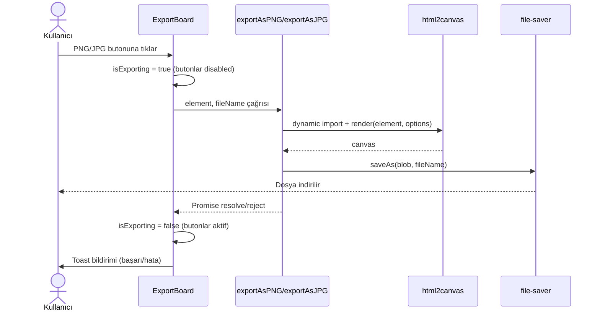

# Tasarım Dokümanı: Board Image Export

## Genel Bakış

Bu özellik, Aksa Retrospektif uygulamasına PNG ve JPG formatlarında görüntü export desteği ekler. Kullanıcılar mevcut "Panoyu Dışa Aktar" ekranından tek tıkla panonun anlık görüntüsünü indirebilecektir.

Teknik yaklaşım:
- `html2canvas` kütüphanesi ile mevcut `PrintView` bileşeninin DOM render'ı yakalanır.
- `file-saver` kütüphanesi ile dosya indirme işlemi gerçekleştirilir.
- `html2canvas` dinamik import ile lazy load edilir; başlangıç bundle boyutu artmaz.
- Yükleme sırasında butonlar devre dışı bırakılır.

### Kapsam

- `utils/export.ts` dosyasına `exportAsPNG` ve `exportAsJPG` fonksiyonları eklenir.
- `ExportBoard.tsx` bileşenine PNG ve JPG butonları eklenir.
- `PrintView` bileşeni gizli bir container içinde render edilip capture edilir.
- `src/i18n/tr/translation.json` dosyasındaki `ExportBoardOption` anahtarına yeni çeviri key'leri eklenir.

---

## Mimari

### Bileşen Etkileşim Diyagramı



### Katman Yapısı

```
ExportBoard.tsx (UI katmanı)
  └── exportAsPNG / exportAsJPG (utils/export.ts — iş mantığı)
        ├── html2canvas (DOM → Canvas dönüşümü)
        ├── fileName() (mevcut yardımcı fonksiyon)
        └── file-saver (indirme)
```

### Gizli PrintView Container Yaklaşımı

`ExportBoard` bileşeni, görünmez bir `div` içinde `PrintView` bileşenini render eder. Bu `div`:
- `position: absolute; left: -9999px; top: -9999px` ile ekran dışına taşınır.
- `html2canvas` bu DOM düğümünü yakalar.
- Render tamamlandıktan sonra `ref` aracılığıyla element `exportAsPNG`/`exportAsJPG` fonksiyonuna iletilir.

---

## Bileşenler ve Arayüzler

### 1. `utils/export.ts` — Yeni Fonksiyonlar

```typescript
/**
 * Verilen HTML elementini PNG formatında yakalar ve indirir.
 * html2canvas dinamik import ile yüklenir.
 */
export const exportAsPNG = async (element: HTMLElement, name?: string): Promise<void> => {
  const html2canvas = (await import("html2canvas")).default;
  const canvas = await html2canvas(element, {
    scale: 2,
    useCORS: true,
    logging: false,
  });
  canvas.toBlob((blob) => {
    if (blob) saveAs(blob, `${fileName(name ?? DEFAULT_BOARD_NAME)}.png`);
  }, "image/png");
};

/**
 * Verilen HTML elementini JPG formatında yakalar ve indirir.
 * html2canvas dinamik import ile yüklenir.
 */
export const exportAsJPG = async (element: HTMLElement, name?: string): Promise<void> => {
  const html2canvas = (await import("html2canvas")).default;
  const canvas = await html2canvas(element, {
    scale: 2,
    useCORS: true,
    logging: false,
  });
  canvas.toBlob((blob) => {
    if (blob) saveAs(blob, `${fileName(name ?? DEFAULT_BOARD_NAME)}.jpg`);
  }, "image/jpeg", 0.92);
};
```

### 2. `ExportBoard.tsx` — Değişiklikler

- `useState<boolean>` ile `isExporting` state'i eklenir.
- Gizli bir `div` içinde `PrintView` bileşeni render edilir; `useRef<HTMLDivElement>` ile referans tutulur.
- PNG ve JPG butonları `SettingsButton` bileşeni ile eklenir.
- Butonlar `isExporting` durumunda `disabled` olur.
- Export tamamlandığında veya hata oluştuğunda `Toast` bildirimi gösterilir.

### 3. `SettingsButton` Bileşeni

Mevcut `SettingsButton` bileşeni `disabled` prop'unu desteklemelidir. Mevcut implementasyon incelenerek gerekirse `disabled` prop desteği eklenir.

### 4. i18n — Yeni Çeviri Key'leri

`src/i18n/tr/translation.json` dosyasındaki `ExportBoardOption` anahtarına eklenmesi gereken key'ler:

```json
"exportAsPNG": "PNG olarak dışa aktar",
"exportAsJPG": "JPG olarak dışa aktar",
"exportImageSuccess": "Görüntü başarıyla indirildi!",
"exportImageError": "Görüntü oluşturulurken hata oluştu. Lütfen tekrar deneyin.",
"exportingAriaLabel": "Görüntü oluşturuluyor..."
```

---

## Veri Modelleri

### `ExportFormat` Tipi

```typescript
export type ExportFormat = "png" | "jpg";
```

### `html2canvas` Seçenekleri

PNG için:
```typescript
const PNG_OPTIONS: Parameters<typeof html2canvas>[1] = {
  scale: 2,
  useCORS: true,
  logging: false,
};
```

JPG için (PNG seçenekleriyle aynı; fark `toBlob` çağrısında):
```typescript
const JPG_QUALITY = 0.92;
const JPG_MIME = "image/jpeg";
```

### Dosya Adı Formatı

Mevcut `fileName(name?)` fonksiyonu kullanılır:
```
{YYYY-MM-DD}_{boardName}.png
{YYYY-MM-DD}_{boardName}.jpg
```

Örnek: `2025-01-15_Sprint-Retro.png`

### Bağımlılık Değişiklikleri

`package.json` dosyasına eklenecek:
```json
"html2canvas": "^1.4.1"
```

TypeScript tip tanımları `html2canvas@1.4.1` paketine dahildir; ayrıca `@types/html2canvas` gerekmez.

---

## Doğruluk Özellikleri (Correctness Properties)

*Bir özellik (property), sistemin tüm geçerli çalışmalarında doğru olması gereken bir karakteristik veya davranıştır — temelde sistemin ne yapması gerektiğine dair biçimsel bir ifadedir. Özellikler, insan tarafından okunabilir spesifikasyonlar ile makine tarafından doğrulanabilir doğruluk garantileri arasındaki köprü görevi görür.*

### Özellik 1: fileName fonksiyonu tarih öneki üretir

*Her* geçerli pano adı için, `fileName(name)` fonksiyonu `YYYY-MM-DD_` formatında bir tarih öneki ile başlayan bir string döndürmelidir.

**Doğrular: Gereksinim 1.3, 2.3, 6.3**

---

### Özellik 2: PNG export dosya uzantısı

*Her* geçerli pano adı için, `exportAsPNG` fonksiyonu `.png` uzantılı bir dosya adı ile `saveAs` çağırmalıdır.

**Doğrular: Gereksinim 1.3, 6.1, 6.4**

---

### Özellik 3: JPG export dosya uzantısı

*Her* geçerli pano adı için, `exportAsJPG` fonksiyonu `.jpg` uzantılı bir dosya adı ile `saveAs` çağırmalıdır.

**Doğrular: Gereksinim 2.3, 6.2, 6.4**

---

### Özellik 4: html2canvas seçenekleri — PNG

*Her* PNG export çağrısında, `html2canvas` `scale: 2`, `useCORS: true`, `logging: false` seçenekleriyle çağrılmalıdır.

**Doğrular: Gereksinim 1.4, 7.3, 7.4**

---

### Özellik 5: html2canvas seçenekleri — JPG

*Her* JPG export çağrısında, `html2canvas` `scale: 2`, `useCORS: true`, `logging: false` seçenekleriyle çağrılmalı; `toBlob` `image/jpeg` MIME türü ve `0.92` kalite değeriyle çağrılmalıdır.

**Doğrular: Gereksinim 2.4, 7.3, 7.4**

---

### Özellik 6: Export sırasında butonlar devre dışı

*Her* export işlemi başladığında, hem PNG hem JPG butonları `disabled` durumuna geçmeli; işlem tamamlandığında veya hata oluştuğunda tekrar etkin hale gelmelidir.

**Doğrular: Gereksinim 3.1, 3.2, 3.3**

---

### Özellik 7: Hata durumunda toast bildirimi

*Her* `html2canvas` render hatası durumunda, kullanıcıya `ExportBoardOption.exportImageError` key'inden okunan Türkçe hata mesajı içeren bir toast bildirimi gösterilmelidir.

**Doğrular: Gereksinim 1.5, 2.5**

---

## Hata Yönetimi

### html2canvas Hataları

`html2canvas` promise'i reddedilirse:
- `try/catch` bloğu hatayı yakalar.
- `Toast.error(...)` ile `ExportBoardOption.exportImageError` key'inden okunan mesaj gösterilir.
- `isExporting` state'i `false` olarak güncellenir; butonlar tekrar etkin hale gelir.
- Hata konsola loglanmaz (`logging: false` zaten ayarlı).

### CORS Hataları

`useCORS: true` seçeneği ile harici kaynaklı görseller (logo, kullanıcı avatarları) için CORS desteği sağlanır. CORS hatası oluşursa `html2canvas` ilgili görseli boş bırakır; export işlemi yine de tamamlanır.

### Boş Canvas

`canvas.toBlob` callback'i `null` döndürürse (tarayıcı desteği yoksa) hata toast'u gösterilir.

---

## Test Stratejisi

### Birim Testleri

Birim testleri belirli örnekleri, kenar durumları ve hata koşullarını doğrular:

- `fileName()` fonksiyonunun `YYYY-MM-DD_name` formatında string döndürdüğü.
- `exportAsPNG` çağrıldığında `html2canvas`'ın doğru seçeneklerle çağrıldığı (mock ile).
- `exportAsJPG` çağrıldığında `toBlob`'un `image/jpeg` ve `0.92` kalite ile çağrıldığı (mock ile).
- `html2canvas` hata fırlattığında `Toast.error`'ın çağrıldığı.
- `ExportBoard` bileşeninde export sırasında butonların `disabled` olduğu.
- `ExportBoard` bileşeninde export tamamlandığında butonların tekrar etkin olduğu.

### Özellik Tabanlı Testler (Property-Based Testing)

Özellik tabanlı testler evrensel özellikleri rastgele girdiler üzerinde doğrular.

**Kullanılacak kütüphane:** `fast-check` (TypeScript/JavaScript için)

**Konfigürasyon:** Her özellik testi minimum 100 iterasyon çalıştırılır.

**Etiket formatı:** `Feature: board-image-export, Property {N}: {property_text}`

#### Özellik Testi 1: fileName tarih öneki

```typescript
// Feature: board-image-export, Property 1: fileName fonksiyonu tarih öneki üretir
it("fileName her zaman YYYY-MM-DD_ ile başlar", () => {
  fc.assert(
    fc.property(fc.string(), (name) => {
      const result = fileName(name);
      expect(result).toMatch(/^\d{4}-\d{2}-\d{2}_/);
    }),
    { numRuns: 100 }
  );
});
```

#### Özellik Testi 2 & 3: Dosya uzantıları (birleştirilmiş)

```typescript
// Feature: board-image-export, Property 2 & 3: PNG/JPG dosya uzantıları
it("exportAsPNG .png, exportAsJPG .jpg uzantısı kullanır", () => {
  fc.assert(
    fc.property(fc.string({ minLength: 1 }), async (name) => {
      // saveAs mock ile doğrulanır
      await exportAsPNG(mockElement, name);
      expect(mockSaveAs).toHaveBeenCalledWith(expect.any(Blob), expect.stringMatching(/\.png$/));

      await exportAsJPG(mockElement, name);
      expect(mockSaveAs).toHaveBeenCalledWith(expect.any(Blob), expect.stringMatching(/\.jpg$/));
    }),
    { numRuns: 100 }
  );
});
```

#### Özellik Testi 4 & 5: html2canvas seçenekleri (birleştirilmiş)

```typescript
// Feature: board-image-export, Property 4 & 5: html2canvas seçenekleri
it("html2canvas her zaman doğru seçeneklerle çağrılır", () => {
  fc.assert(
    fc.property(fc.record({ format: fc.constantFrom("png", "jpg") }), async ({ format }) => {
      if (format === "png") await exportAsPNG(mockElement, "test");
      else await exportAsJPG(mockElement, "test");

      expect(mockHtml2canvas).toHaveBeenCalledWith(
        expect.any(HTMLElement),
        expect.objectContaining({ scale: 2, useCORS: true, logging: false })
      );
    }),
    { numRuns: 100 }
  );
});
```

#### Özellik Testi 6: Export sırasında buton durumu

```typescript
// Feature: board-image-export, Property 6: Export sırasında butonlar devre dışı
it("export sırasında butonlar disabled, sonrasında aktif olur", () => {
  fc.assert(
    fc.property(fc.constantFrom("png", "jpg"), async (format) => {
      const { getByTestId } = render(<ExportBoard />);
      const button = getByTestId(`export-${format}`);

      // Export başlatılır
      fireEvent.click(button);
      expect(button).toBeDisabled();

      // Export tamamlanır
      await waitFor(() => expect(button).not.toBeDisabled());
    }),
    { numRuns: 100 }
  );
});
```

#### Özellik Testi 7: Hata durumunda toast

```typescript
// Feature: board-image-export, Property 7: Hata durumunda toast bildirimi
it("html2canvas hatası durumunda Toast.error çağrılır", () => {
  fc.assert(
    fc.property(fc.string(), async (errorMessage) => {
      mockHtml2canvas.mockRejectedValueOnce(new Error(errorMessage));
      await exportAsPNG(mockElement, "test").catch(() => {});
      expect(mockToastError).toHaveBeenCalled();
    }),
    { numRuns: 100 }
  );
});
```
