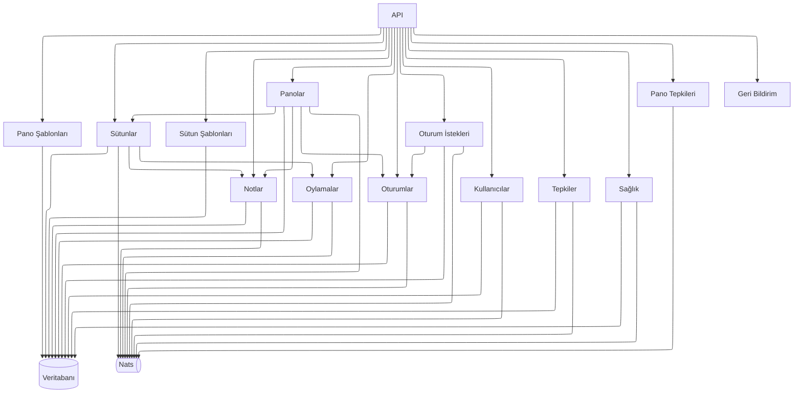
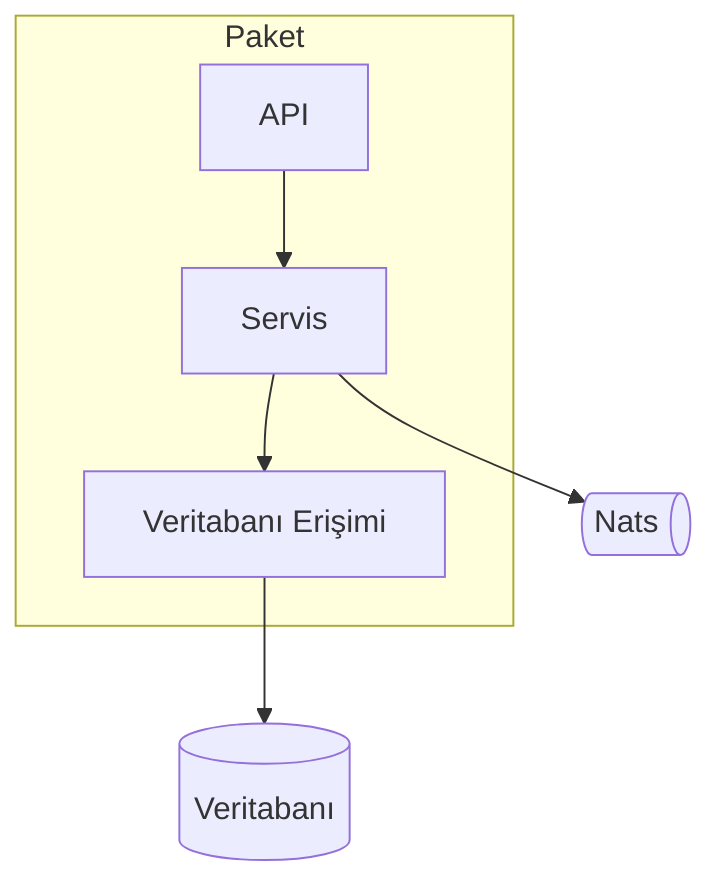

# Backend Mimarisi

Aşağıdaki diyagramda backend paketleri ve birbirleriyle nasıl etkileşime girdikleri gösterilmektedir.

## Paket Yapısı

Genel paket yapısı aşağıdaki diyagramda gösterilmektedir.

Her paketin en az bir API ve bir servisi vardır. Servisin veritabanına erişmesi gerekiyorsa bir veritabanı erişim katmanı oluşturulur. Servisin kendi kontrolünde olmayan bir veritabanına erişmesi gerekiyorsa ilgili servis enjekte edilir. Mesaj aracısına erişim için `realtime` paketi kullanılır.
